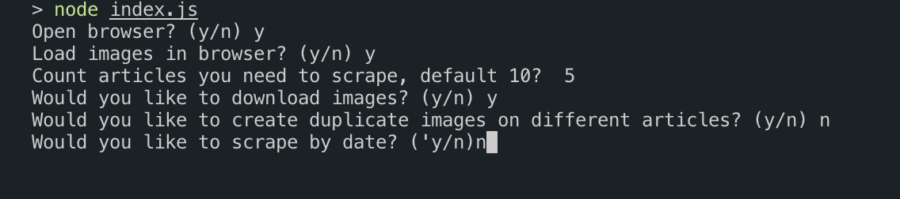
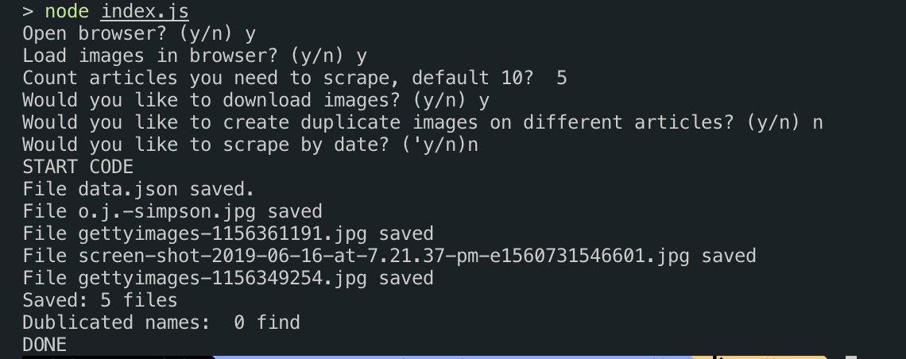
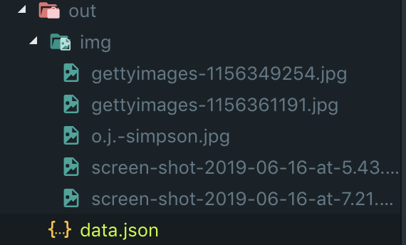

# Parser module

## On branch `stdin` module work in console

1. open terminal in root directory of project, where you can see index.js
2. in terminal run command `node index`
3. need to answer on questions to run scraper
4. in directory `out` get your result

    
    
    

### BigLead module

| method                | params         | default | return                             |
| --------------------- | -------------- | ------- | ---------------------------------- |
| init                  | openBrowser    | `true`  | new instanse Browser and open Page |
|                       | images         | `true`  | load images `true` or `false`      |
|                       | devtools,      | `false` |                                    |
|                       | filterByDate   | `false` |                                    |
| getArticlesLinks      | count          | 10      | `Array` links                      |
| getArticlesDataByLink | links          | -       | `Array` data articles              |
| getImagesLinksAndName | articles       | -       | `Array` of `Object` images         |
| downloadImages        | images arr obj | -       | download images                    |
| saveDataJSON          | data           | arr     | save data on disc                  |
| setPageURL            | string         | string  | change `url`                       |
| end                   | -              | -       | remove instanse Browser            |

